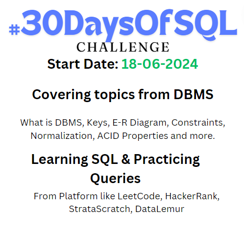

# SQLFromScratch
This repository is to doucment my DBMS & SQL learning journey and to Practice SQL Queries.

## Quick Links
- [DBMS](./DBMS/)
- [SQL](./SQL/)
- [SQL Queries](./SQLQueries/)

# 30DaysOfSQL

## Day-01
- [DBMS](./DBMS/readme/1-Intro-to-DBMS/)
- [SQL](./SQL/readme/1-intro-to-SQL/)
- [SQL Practice](./SQLQueries/practice/Easy/1-remove-duplicate/)

# Resources
- techtfq -[Youtube](https://www.youtube.com/c/techTFQ)
- Everyday Data Scienece- [Youtube](https://www.youtube.com/@EverydayDataScience)